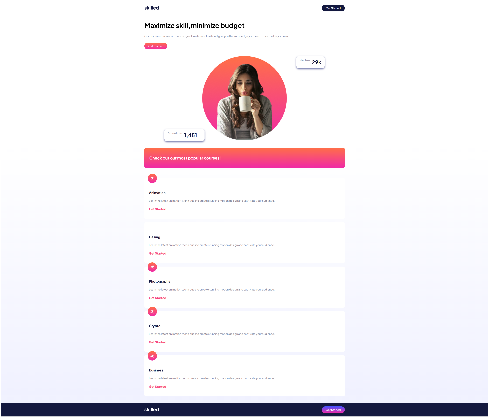

# Landing-Page-Responsive
Este proyecto es una plantilla de sitio web moderno que utiliza responsive para adaptarse a las distintas pantallas de los dispositivos, utilizando HTML5 y CSS3.


## Tecnologías
- HTML5
- CSS3
- Sass

## Instalación
1. Clona este repositorio
```bash
git clone https://github.com/IanBejenaru/Landing-Page-Responsive.git